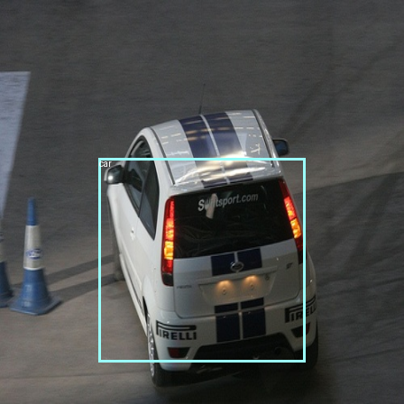
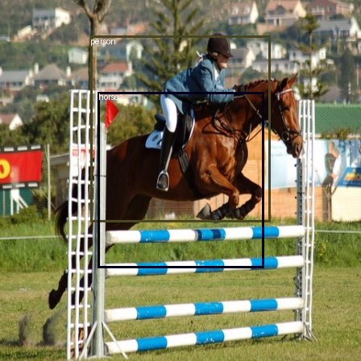
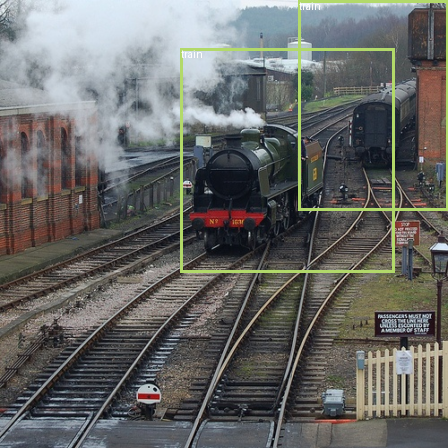

# yolo v1
object detection with yolo v1 using pytorch

### Introduction

[You Only Look Once: Unified, Real-Time Object Detection](https://arxiv.org/pdf/1506.02640) 논문을 참고하여 구현했습니다.
학습 데이터셋은 PascalVOC2012(train/val), PascalVOC2007(train/test/val)을 사용했습니다.


### Requirements
After cloning the repo, run this line below:
```
pip install -r requirements.txt
```

### Usage

##### 1. train model
```
mkdir model
python -m yolov1.train

# inference
python -m yolov1.inference -img {이미지 경로}
```

##### 2. statistics
| model        | # params | mAP(%) |
|--------------|----------|--------|
| VGG16 YOLOv1 | 259M     | -      |


##### 3. plots
- train loss


- valid loss


##### 4. inference result





##### 5. To be revised

- not precisely detected
- mAP function not well implemented
- valid loss not well converged to zero